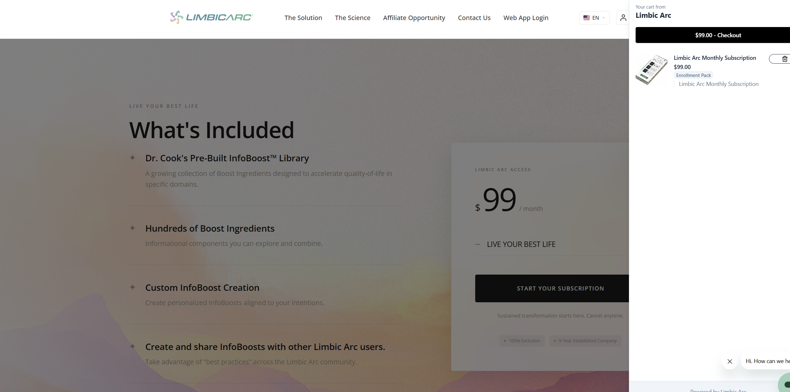
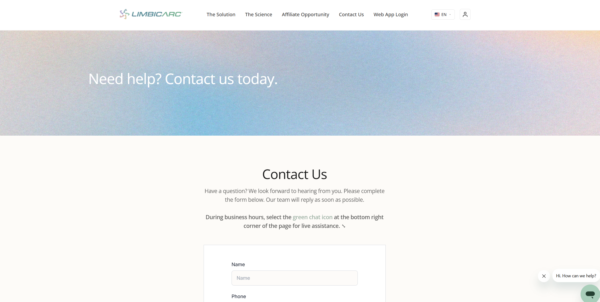
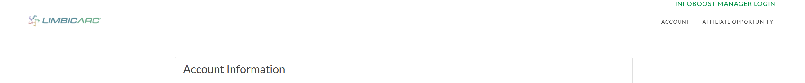
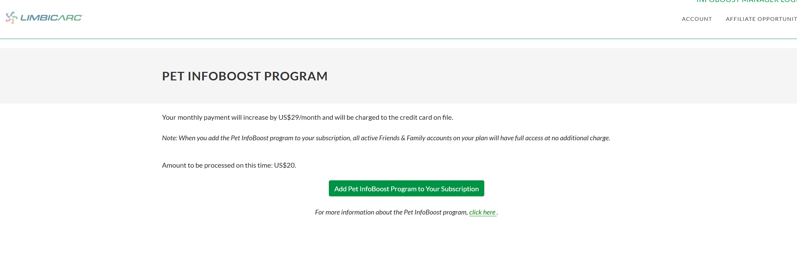
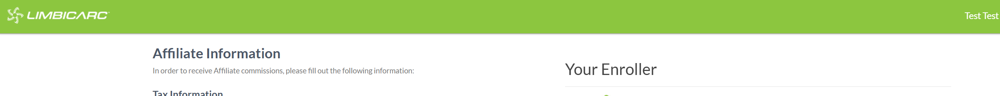
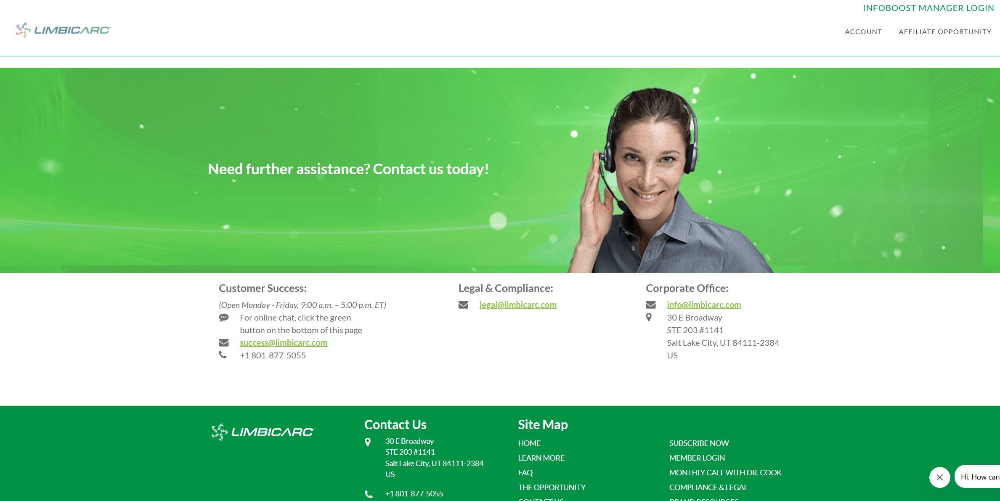
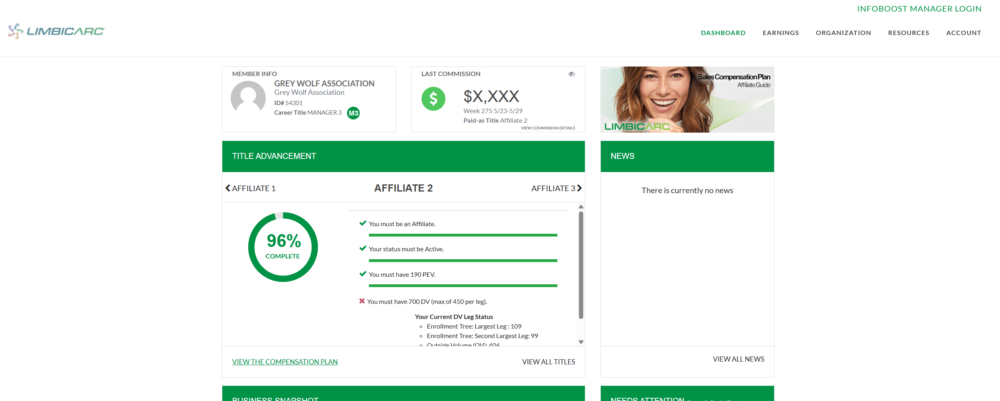

# Limbic Arc — Integration & Platform Technical Assessment

*Version 0.3 · 2026-06-01*

---

## 1. Executive Summary

Limbic Arc runs a direct-selling (MLM) business on two primary platforms: Exigo as the MLM/commission engine and back office, and Fluid (fluid.app) as the modern e-commerce/shopping experience. Exigo is a strong commission and genealogy engine; Fluid is a strong storefront and rep-enablement app. The missing component is not either platform individually — it is the seam between them, the legacy Exigo .NET boilerplate the web properties are built on, and the absence of dedicated technical representation on Limbic Arc's side: the company works through capable vendors but has no technical counterpart of its own to steer them.

The system today exhibits five compounding issues:

1. **Split source of truth.** Profiles, subscriptions, and especially payment tokenization live in both Exigo and Fluid with no single authority. Card tokenization happening in multiple places is the sharpest edge of this and the root of the subscription/billing fragility.
2. **Tightly-coupled legacy front end.** The customer admin and distributor back office are forked from Exigo's .NET boilerplate, with no front-end/back-end separation, thin documentation, and a hard dependency on Exigo for any change. Velocity and cost of change are dictated by Exigo's queue, not Limbic Arc's roadmap.
3. **Fragmented, inconsistent user experience.** At least three distinct visual identities are live at once (modern Fluid, white-header Exigo admin, green-header Exigo affiliate). Users also re-authenticate when crossing system boundaries.
4. **Missing platform foundations.** No role-based access control (RBAC) on the sites, limited administrative tooling, no defined CI/CD discipline, and analytics that capture data but don't yet drive decisions.
5. **No technical representation on Limbic Arc's side.** Limbic Arc works through external vendors (Exigo, Fluid, and others) but has no technical counterpart of its own to own the code or direct those vendors — which is why change waits in the vendor queue and the company stays in reactive "firefighting" mode.

**Recommendation:** Adopt a Strangler Fig modernization strategy — incrementally extract the bottleneck domains (Profile, Payments/Tokenization, Subscriptions, Family & Friends, Signup/Upgrade) out of the Exigo boilerplate into independently deployable, API-fronted services, with an explicit, enforced source-of-truth contract per domain. Keep Exigo as the system of record for commissions, genealogy, and profile; let Fluid own commerce and tokenization; and stop retrofitting Exigo for things it was never designed to do.

---

## 2. Scope

**In scope:** Customer-facing landing/subscription site, customer admin, distributor (affiliate) admin/back office, the Exigo↔Fluid integration seam, subscriptions, payments/tokenization, profile, family & friends, data/analytics, and platform concerns (hosting, observability, CI/CD, security/RBAC, AI enablement).

**Explicitly out of scope:** The Web App itself — except the single touchpoint that users should not have to re-authenticate to reach it (SSO).

---

## 3. Current-State System Inventory

| # | System | Platform / Stack | Primary Role | Source-of-truth today |
|---|--------|------------------|--------------|------------------------|
| 1 | Landing / subscription site (limbicarc.com) | Fluid (modern) | Marketing, plan discovery, subscribe/checkout | Fluid for new commerce |
| 2 | Customer Admin | Exigo .NET boilerplate (white-header theme) | Account info, subscription mgmt, card update, Pet InfoBoost, Family & Friends | Exigo (tokenizes card in Exigo) |
| 3 | Distributor / Affiliate Admin (Back Office) | Exigo .NET boilerplate (green-header theme) | Genealogy, title advancement, commissions, affiliate onboarding, tax info | Exigo |
| 4 | MLM / Commission Engine | Exigo | Genealogy, volume, commission calculation & payout | Exigo (correct) |
| 5 | Replicated site (Exigo storefront flows) | Exigo boilerplate | Exigo's native commerce/replicated-site flows | Exigo |
| 6 | Web App | (out of scope, SSO touchpoint only) | Core product experience | — |

**On the "replicated site":** Its low usage reflects low functionality, not few users — the boilerplate-derived flows are thin, yet all users pass through them. It therefore sits on the critical path and cannot be dismissed or retired as "low priority." Any change to login, profile, or subscription touches surfaces every user sees.

### 3.1 Visual / UX evidence (from screenshots)

The screenshot set demonstrates three concurrent design languages — the visible surface of the deeper architectural split.

**Modern Fluid theme** — gradient hero ("Join The Movement"), "What's Included / $99" subscription page with a slide-in checkout drawer, modern Contact Us.

**Exigo Customer Admin, white header** — "Account Information", "Pet InfoBoost Program" upsell with inline pricing/charge logic.

**Exigo Affiliate/Distributor, green header** — "Affiliate Information / Your Enroller", the distributor dashboard with "Title Advancement", compensation plan, news widgets, and an older green "Contact us" page.

A user moving from "subscribe" (Fluid) → "manage my account" (Exigo customer) → "affiliate opportunity / back office" (Exigo distributor) crosses three different-looking applications, and logs in more than once along the way.

---

## 4. 12-Factor App Scorecard

A 12-Factor assessment of the Exigo .NET boilerplate codebase highlights where it diverges from cloud-native delivery practices, and why change is slow and risky.

| Factor | Status | Finding |
|---|---|---|
| I. Codebase | Partial | Two apps in one repo, shared compiled library |
| II. Dependencies | Fail | Static globals are invisible dependencies |
| III. Config | Fail | Credentials in committed Web.config |
| IV. Backing Services | Pass | Exigo, Redis, SQL treated as attached resources |
| V. Build/Release/Run | Partial | No CI/CD evidence; msbuild exists |
| VI. Processes | Partial | Mostly stateless; `Identity.Current` is ambient state |
| VII. Port Binding | Pass | Azure App Service handles this |
| VIII. Concurrency | Fail | Mixed sync/async; deadlock risk; no scale-out proof |
| IX. Disposability | Unknown | No graceful shutdown hooks observed |
| X. Dev/Prod Parity | Partial | Cache abstraction helps; config diverges |
| XI. Logs | Unknown | No structured logging library observed |
| XII. Admin Processes | Unknown | `ScheduledTaskService` exists but in-process |

**Salvageable assets:** the boilerplate is not all liability. Some of the Fluid integrations already implemented in the back office — the working API calls, authentication/handshake, and data-mapping logic between Exigo and Fluid — can be reused. Rather than rewriting these from scratch, the extraction work (§8) should lift this integration logic out of the coupled boilerplate, wrap it behind a clean anti-corruption layer, and carry it forward into the new services. This reduces the cost and risk of Phase 3 (Payments & Subscriptions) and preserves hard-won knowledge about how the two platforms actually exchange data.

---

## 5. Underlying Causes (the "why", not just the "what")

The complaints in the write-up are symptoms of a small number of underlying causes. Naming them keeps the recommendations honest.

**Cause A — Exigo boilerplate was never meant to be a long-term product surface.**
Exigo's strength is the commission/genealogy engine and its data architecture (200+ APIs, replicated data, SOC 2 Type II). The .NET boilerplate "replicated site" code ships to bootstrap a customer onto Exigo's own commerce flows — it is a starter kit, not a product platform. Limbic Arc has retrofitted it to do things (custom subscriptions, third-party commerce, Family & Friends, Pet InfoBoost upsells) it was not designed for.

**Cause B — No separation of concerns in the legacy front end.**
The customer and distributor sites have no front-end/back-end boundary; presentation, business logic, and Exigo data access are interleaved. Combined with thin documentation, every change requires Exigo tribal knowledge, so Limbic Arc cannot move without Exigo, and Exigo's priority queue sets Limbic Arc's release timeline.

**Cause C — No designated source of truth per domain.**
Two platforms (Exigo, Fluid) each independently hold profile/subscription/payment data, so the same business object exists in two places with divergent state. This is the direct mechanism behind tokenization fragmentation and subscription/billing inconsistency.

**Cause D — Missing platform engineering foundations.**
No RBAC, limited admin tooling, no CI/CD discipline, reactive observability. These don't cause the architectural gap but they amplify it: every fix is slow, risky, and hard to verify.

**Cause E — No technical representation on Limbic Arc's side.**
Limbic Arc works through external vendors but has no technical counterpart of its own. This is the upstream cause of B and D and the reason the company is locked into the vendor queue: with no one on Limbic Arc's side to own the code or direct the vendors, every change is outsourced on the vendor's timeline. Architecture alone does not fix this — technical representation must be put in place.

> **Guiding principle:** This is not "replace Exigo" and not "replace Fluid." It is "own the seam and the surfaces." Extract the contested domains into Limbic-Arc-owned services with clear contracts to each platform.

---

## 6. Deep Dive — Subscriptions & Payment Tokenization (the #1 technical risk)

The write-up correctly identifies subscriptions as the primary area of concern, with tokenization as the sharpest edge. This deserves its own treatment because it is where the split-source-of-truth gap does the most damage.

### 6.1 What's happening (the fragmentation)

- Subscriptions exist partly in Exigo, partly in Fluid. Card tokenization happens in both — a customer updating their card in the Exigo customer admin tokenizes in Exigo; a Fluid checkout tokenizes in Fluid.
- There is no authoritative mapping between the Exigo payment token and the Fluid payment token for the same customer/card, and no single system that owns "the card on file."
- The result is divergent billing state across the two platforms and brittle, hard-to-reason-about subscription behavior.

### 6.2 Why "tokenize everywhere" is the trap

PCI tokens are gateway/processor-scoped — an Exigo token and a Fluid token are not interchangeable even for the same card, because they may reference different merchant accounts/processors. So "the card is on file in both systems" does not mean "billing state is consistent," and reconciling by card number is itself a PCI anti-pattern. The only durable fix is one tokenization authority.

### 6.3 Target state (recommended)

1. Fluid is the single tokenization authority and recurring-billing processor of record (matches the stated desired state). All card capture/update — including the flows currently in Exigo customer admin — route to Fluid's vault.
2. Limbic Arc's own sites should collect no card data and sit out of PCI scope. Card capture/update is delegated entirely to Fluid via hosted fields / redirect / iframe, so raw PAN never touches a Limbic Arc surface. This is both a risk reduction and a major PCI-scope reduction (potentially SAQ-A).
3. The Exigo customer-admin "update card" screen must stop tokenizing in Exigo. Replace it with the Fluid-hosted capture above. Until this is done, tokenization remains fragmented. This is the single highest-value technical fix.
4. Subscription state has one owner (Fluid, target). Exigo should receive subscription/payment events (for volume/commission purposes) rather than independently initiating billing.
5. Token-consistency reconciliation during migration. While both systems still hold tokens, a scheduled reconciliation compares Exigo-side and Fluid-side billing records and flags mismatches so they're caught and corrected proactively rather than surfacing to customers.

---

## 7. Source-of-Truth Model (expanded from the write-up table)

| Domain | Current state | Target SoT | Why | Sync direction (target) |
|--------|---------------|-----------|-----|--------------------------|
| Profile / Identity | Mixed (Exigo + Fluid) | Exigo | Identity must be singular; Exigo holds genealogy keyed to the person. A Profile service fronts it as an API, but Exigo remains the record. | Profile svc (facade over Exigo) → Fluid (push) |
| Payin / Tokenization | Mixed (Exigo + Fluid) | Fluid | One PCI vault, one processor of record; removes fragmentation; keeps Limbic Arc sites out of PCI scope | Card capture → Fluid only |
| Commission payouts | Exigo | Exigo | Core competency; do not move | Exigo authoritative |
| Family & Friends | Exigo extended (retrofit) | Separate service | Retrofit is brittle; cross-cuts profile + subscription + entitlement | F&F svc ↔ Exigo + Fluid |
| Subscriptions | Mixed | Fluid | Commerce/recurring billing is Fluid's strength | Fluid → Exigo (events for volume) |

**Profile decision:** Profile source of truth is Exigo. The recommended Profile service is an API facade + event publisher in front of Exigo-as-record — it does not introduce a competing identity store. This reconciles "extract profile into a separate application with APIs" (the write-up) with "Profile SoT = Exigo": the interface is extracted; the record stays in Exigo.

**Governance rule to adopt:** Exactly one system may be the writer/owner for each domain. Every other system is a read-replica/subscriber that receives changes via events or sync. No screen anywhere may write to a non-owning system. Enforced, this single rule prevents the entire class of "mixed" bugs.

---

## 8. Target Architecture & Recommendations

### 8.1 Strategy: Strangler Fig, not big-bang rewrite

Incrementally route specific capabilities away from the Exigo boilerplate to new Limbic-Arc-owned services behind a stable API/facade, retiring boilerplate code domain-by-domain. This preserves the working commission engine, contains risk, and lets the delivery group demonstrate value early.

### 8.2 Extracted services (matches & extends the write-up's recommendations)

Sequenced by value × urgency:

1. **Payments / Tokenization service** *(do first — removes fragmentation, cuts PCI scope)* — Fronts Fluid's vault; becomes the only path for card capture/update; replaces the Exigo-side tokenization in customer admin; ensures Limbic Arc surfaces hold no card data.
2. **Subscriptions service** *(second — the primary area of concern)* — Owns subscription lifecycle on Fluid; publishes events to Exigo for volume/commission.
3. **Profile service** *(third — unblocks everything)* — Single identity API in front of Exigo-as-record; the SSO and RBAC anchor.
4. **Family & Friends service** *(fourth)* — Removes the brittle Exigo retrofit; models entitlements/relationships cleanly (this is what makes "Pet InfoBoost free for active F&F" and "birthday discount" tractable — see §11).
5. **Signup / Upgrade flow application** *(fifth, partly enabled by 1–4)* — Unified, modern enrollment + upgrade across customer and affiliate, built on the services above.

**Architectural guardrails for the new services:**
- API-first, contract-tested boundaries (OpenAPI; consumer-driven contract tests so Exigo/Fluid schema drift is caught in CI, not production).
- Event-driven sync with an outbox pattern + idempotent consumers — this makes the 2-way sync Fluid advertises reliable instead of a race condition.
- Anti-corruption layer in each service so Exigo's and Fluid's data models don't leak into Limbic Arc's domain.
- Front-end/back-end separation — new surfaces are a thin modern web front end calling these APIs, not more coupled .NET boilerplate. This is what finally breaks the Exigo-dependency for changes.

### 8.3 Cross-cutting platform foundations

| Concern | Current | Recommendation |
|--------|---------|----------------|
| Delivery capability | Vendor-led; no Limbic Arc technical representation | Put technical representation in place (a small product-engineering capability and/or an integration partner) to own the code and direct vendors; this is the gating dependency |
| Identity / SSO | Re-login across systems | Central IdP (OIDC) so customer/affiliate session carries into the Web App and across surfaces — fixes the out-of-scope touchpoint |
| RBAC | None on the sites | Role/claim model at the IdP + per-service authorization; admin vs. customer vs. affiliate vs. support |
| Hosting | Shared/unclear | Dedicated cloud subscription/tenant for Limbic Arc (isolation, cost attribution, blast-radius control) |
| Observability | Limited / reactive | Datadog — distributed tracing across the Exigo↔Fluid seam, token-consistency dashboards, synthetic checks on checkout/card-update |
| CI/CD | Not defined | Branch strategy, automated build/test gates, IaC, progressive deploys; enforce test-first discipline as the delivery group builds new services |
| Analytics | GA + Power BI (capture only) | Define business-health metrics (see the Data & Analytics companion) and a semantic layer; move from "we have dashboards" to "dashboards drive decisions" |

---

## 9. Security & Compliance Findings

- **No RBAC = authorization gap.** Without roles, any authenticated user may reach functions they shouldn't; support/admin actions aren't separated. High priority.
- **Single-sign-on absence** is both UX and security tech debt (more credential surfaces, inconsistent session/MFA policy).
- **Audit trail.** With multiple writers to profile/subscription/payment, there is likely no unified audit log of "who changed what, where." Needed for dispute/billing investigations.
- **Vendor lock-in / exit risk.** Boilerplate code is non-portable if Limbic Arc ever leaves Exigo. The extracted-services architecture is the mitigation — it makes the engine replaceable behind a stable contract.

---

## 10. AI Enablement (from "defense" to "offense")

The write-up's framing — playing defense when we should be on offense — is correct, and AI-assisted delivery is especially relevant: a lean delivery group augmented with AI development can punch above its weight. The architecture work is the prerequisite — AI features are hard on coupled boilerplate, easy on clean APIs + unified data.

- **Internal / developer velocity:** AI-assisted development to help a lean group move quickly and reduce firefighting; automated triage of support/billing issues.
- **Customer-facing (offense):** AI-curated InfoBoost recommendations ("Custom InfoBoost Creation" is already a product hook — image 4), churn-risk prediction with proactive save offers, distributor coaching/"next best action" (Fluid already ships an AI assistant, "Catchups", to integrate with rather than rebuild).
- **Guardrail:** AI features should consume the Profile/Subscription/Payments APIs, never the legacy boilerplate directly — otherwise they inherit the coupling.

---

## 11. "What If" Scenarios — Mapped to the Target Architecture

| Use case | Hard today because… | Enabled by… | Difficulty (post-extraction) |
|----------|---------------------|-------------|------------------------------|
| Common banner for a user group on all logged-in pages | No shared layout/component across the 3 surfaces; no group/segment concept; no RBAC/segmentation | Shared front-end shell + Profile/segment service + feature-flag/targeting | Low |
| Modernize Contact Us to match Fluid | Page lives in Exigo green-theme boilerplate; change needs Exigo | Move surface to modern front end calling APIs | Low–Med |
| Match modern UX site-wide | Three coupled apps, no design system, Exigo dependency | Design system + progressive surface migration (Strangler Fig) | Med–High |
| User-customizable theme / movable widgets / saved prefs | No user-preference store; no componentized front end | Profile/preferences service + component-based UI | High |
| 5% F&F birthday discount | F&F is an Exigo retrofit; discount engine + DOB + billing all split across Exigo/Fluid | F&F service (entitlements) + Subscriptions/Payments service (promo applied at billing in Fluid) + event on birthday | Med–High |

**Insight:** every "even harder" case collapses to the same four missing capabilities — a profile/preferences store, a clean F&F entitlement model, a single billing/promo authority, and a componentized front end. That is exactly what §8 builds. The roadmap pays for itself across all of these, not just one.

---

## 12. Roadmap

> Sequenced to put delivery capability in place first, consolidate payments/identity second, modernize experience third, then go on offense. Phase 1 gates everything after it. Durations are placeholders to size with the delivery group.

### Phase 1 — Establish delivery capability & stop new tech debt *(foundational; gating)*
- **Goal:** Have technical representation that can own the code, and stop the issues that are cheap to stop.
- **Why now:** Every later phase assumes a delivery group exists to execute it.
- **Workstreams:**
  - Put technical representation in place — a small product-engineering capability and/or a vetted Exigo/Fluid integration partner; define the operating model (who owns what, on-call, change process).
  - Knowledge capture: document the current Exigo boilerplate, integration points, and the Exigo↔Fluid data flows (reduce reliance on Exigo tribal knowledge).
  - Quick defensive wins: audit logging on profile/subscription/payment writes; token-consistency reconciliation/flagging (§6.3); freeze new Exigo-side tokenization wherever avoidable.
- **Key deliverables:** Delivery group/partner in place; current-state integration map; reconciliation exception report; decision log.
- **Dependencies:** Budget + staffing/contracting decision (executive).
- **Exit criteria:** A named delivery group can ship a change end-to-end without routing through Exigo's queue; reconciliation flagging is live.

### Phase 2 — Platform foundations
- **Goal:** The "paved road" every later service rides on.
- **Workstreams:**
  - Dedicated cloud subscription/tenant; Infrastructure-as-Code.
  - CI/CD with automated build/test gates; test-first discipline baked in from day one.
  - Central IdP (OIDC) + RBAC skeleton (roles: customer, affiliate, admin, support).
  - Observability baseline in Datadog: tracing across the Exigo↔Fluid seam, synthetic checks on checkout & card-update, token-consistency dashboard.
- **Key deliverables:** Cloud landing zone; pipeline; IdP with SSO for one surface; RBAC role model; dashboards.
- **Dependencies:** Phase 1 delivery group; hosting decision.
- **Exit criteria:** A new service can be deployed through CI/CD into the dedicated cloud, behind SSO, with traces visible.

### Phase 3 — Payments & Subscriptions extraction *(resolves the #1 missing component)*
- **Goal:** One tokenization authority (Fluid); Limbic Arc sites hold no card data; subscriptions have one owner.
- **Workstreams:**
  - Payments/Tokenization service fronting Fluid's vault; migrate the Exigo customer-admin "update card" flow to Fluid-hosted capture; retire Exigo-side tokenization.
  - Confirm and reduce PCI scope to (near) zero on Limbic Arc surfaces.
  - Subscriptions service owning lifecycle on Fluid; emit volume/commission events to Exigo (outbox + idempotent consumers).
  - Migration plan for subscriptions currently in Exigo → Fluid, sized by the current volume split.
- **Key deliverables:** Payments API; no-card-data customer-admin flow; Subscriptions API; Exigo event feed; PCI scope reassessment.
- **Dependencies:** Fluid API capabilities for hosted capture / subscription events / 2-way sync; Phase 2.
- **Exit criteria:** No Limbic Arc surface captures raw card data; new/changed subscriptions are owned by Fluid; Exigo receives the events it needs for commissions.

### Phase 4 — Profile & Family/Friends extraction
- **Goal:** Single identity API (Exigo-as-record) and a clean F&F entitlement model.
- **Workstreams:**
  - Profile service as a facade over Exigo; publish profile-change events; becomes the SSO/RBAC anchor and the segmentation source.
  - Family & Friends service replacing the Exigo retrofit; model relationships + entitlements (enables "Pet InfoBoost free for active F&F", birthday discount, segmentation).
- **Key deliverables:** Profile API + event stream; F&F entitlement service; segment/group capability.
- **Dependencies:** Phase 2 (IdP/RBAC); Phase 3 patterns.
- **Exit criteria:** Surfaces read identity/segments from the Profile service; F&F logic no longer lives in Exigo boilerplate.

### Phase 5 — Unified Signup/Upgrade + UX modernization
- **Goal:** One modern experience; retire the three-theme split; SSO into the Web App.
- **Workstreams:**
  - Modern front-end shell + design system; progressively migrate surfaces off the green/white Exigo boilerplate (Strangler Fig).
  - Unified Signup/Upgrade application across customer and affiliate, built on Phases 3–4 services.
  - SSO carries the session into the Web App (closes the out-of-scope touchpoint).
- **Key deliverables:** Design system; migrated Contact Us / account / affiliate surfaces; unified enrollment; cross-surface SSO.
- **Dependencies:** Phases 2–4.
- **Exit criteria:** Users see one consistent experience and authenticate once; new pages are built on the modern front end, not boilerplate.

### Phase 6 — Analytics & AI "offense"
- **Goal:** Data drives decisions; first customer-facing AI features ship.
- **Workstreams:**
  - Event-fed data warehouse; business-health dashboards (see the Data & Analytics companion) including billing-integrity and field-health metrics.
  - First AI features on clean APIs: InfoBoost recommendations, churn-risk save offers, distributor next-best-action (integrate Fluid "Catchups").
- **Key deliverables:** Warehouse + semantic layer; KPI dashboards; 1–2 shipped AI features.
- **Dependencies:** Services emitting events (Phases 3–4); leadership agreement on KPIs.
- **Exit criteria:** Leadership reviews a single source of business-health truth; at least one AI feature is in production.

> **Parallelization note:** Phases 1–2 are strictly sequential and gating. Phases 3–4 can overlap once foundations exist; Phase 5 trails 3–4; Phase 6 can start its data work during Phase 4.

---

*Companion documents: Changelog; Verification Items; Appendix (Data & Analytics, Open Questions, Sources).*
